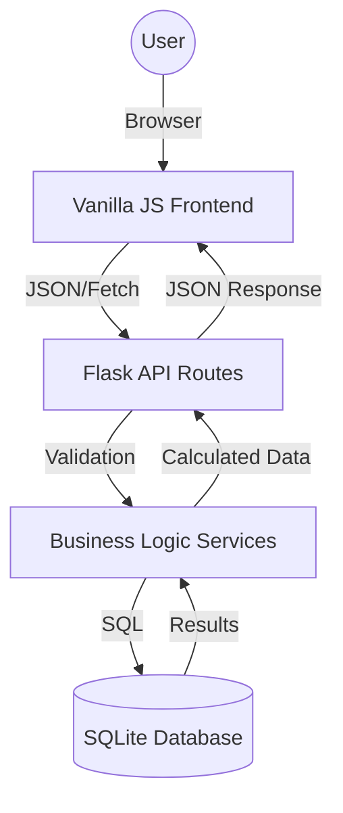

# Habit Tracker - Code Documentation

This document provides a technical overview of the Habit Tracker codebase, its architecture, and data flow.

## 1. File & Folder Structure

```text
habit-tracker/
├── app/                    # Main Flask application
│   ├── routes/             # API Endpoints (Blueprints)
│   │   ├── calendar.py     # Month-view data aggregation
│   │   ├── data.py         # CSV Import/Export
│   │   ├── entries.py      # Habit status toggling & notes
│   │   ├── goals_routes.py # Goal CRUD
│   │   ├── habits.py       # Habit CRUD
│   │   ├── health.py       # DB integrity & repair
│   │   ├── pages.py        # Static page serving (Dashboard/Help)
│   │   └── settings.py     # App settings persistence
│   ├── services/           # Business Logic
│   │   ├── csv_handler.py   # ZIP/CSV packaging & parsing
│   │   ├── day_boundary.py  # Logic for late-night extensions
│   │   ├── db_repair.py     # SQLite dump/reimport recovery
│   │   ├── goals.py         # Progress evaluation engine
│   │   └── streak.py        # Algorithmic streak calculation
│   ├── static/             # Frontend Assets
│   │   ├── css/            # base.css, themes.css, animations.css
│   │   ├── js/             # api.js, calendar.js, habits.js, etc.
│   │   └── img/            # favicon.svg
│   ├── templates/          # Jinja2 Templates (index.html, help.html)
│   ├── __init__.py         # App factory & Blueprint registration
│   ├── config.py           # Path & Port configuration
│   └── database.py         # SQLite connection & migration engine
├── database/               # Local SQLite storage (Gitignored)
├── tests/                  # Test Suite
│   ├── test_smoke.py       # API stability & health tests
│   └── test_streak.py      # Streak engine unit tests
├── launch.bat              # Windows Launcher
├── launch.sh               # Linux/macOS Launcher
├── run.py                  # Entry Point script
├── requirements.txt        # Python dependencies
└── LICENSE                 # GPL v3 License
```

## 2. High-Level Architecture

The application follows a **Modular Monolith** pattern using Flask Blueprints. It is designed to be **strictly local-first**, meaning no external APIs, cloud storage, or internet connection is required after initial setup.

-   **Backend**: Python/Flask handles routing, data validation, and complex streak/goal calculations.
-   **Frontend**: A Single-page Application (SPA) feel built with Vanilla JavaScript, communicating via a REST-like API.
-   **Database**: SQLite with WAL (Write-Ahead Logging) for reliable local storage and integrity.

## 3. Core Modules

| Module | Purpose | Key Function |
| :--- | :--- | :--- |
| `streak.py` | Calculates current/best streaks | `calculate_streaks()` |
| `goals.py` | Evaluates daily/weekly/custom goals | `evaluate_goal()` |
| `day_boundary.py` | Handles "cutoff hour" extensions | `get_effective_date()` |
| `csv_handler.py` | ZIP based data portability | `export_to_zip()`, `import_from_csv()` |
| `db_repair.py` | Self-healing DB mechanism | `repair_database()` - Now moves corrupt files to `.corrupt` extension. |

## 4. Data Flow



1.  **Status Toggle**: User clicks a cell -> `calendar.js` -> `API.post('/api/entries')` -> `entries.py` -> `streak.py` updates stats -> Response returns updated UI state.
2.  **Date Logic**: All entries use `day_boundary.py` to determine if a 2 AM action belongs to "Today" or "Yesterday" based on user settings.
3.  **Note Management**: Users can add or **clear** notes. Clearing a note via the UI calls `entries.py` which preserves the entry status while wiping the description.
4.  **UI Stickiness**: The calendar table uses `position: sticky` for the first column and headers, effectively locking the habit names and dates during horizontal/vertical scrolling.

## 5. Execution Flow

1.  **Launch**: `run.py` starts -> `create_app()` initializes -> `database.py:init_db()` runs migrations.
2.  **Frontend Boot**: `index.html` loads -> `app.js` initializes modules -> `ThemeManager` applies CSS vars -> `Calendar.load()` fetches initial month view.
3.  **Active Sessions**: User interacts with the calendar; JS pulses the UI and plays confetti animations on habit completion without page reloads.

## 6. Dependencies

-   **Runtime**: Python 3.10+, `Flask==3.1.0`.
-   **Frontend**: Modern Browser (ES6+ support required).
-   **Environment**: Cross-platform (Windows/Linux/macOS).
```

## 7. Performance Considerations

The Habit Tracker is optimized for low-resource local environments:

1.  **SQLite WAL Mode**: The database operates in Write-Ahead Logging mode (`PRAGMA journal_mode=WAL`), which allows multiple readers and one writer concurrently, significantly improving responsiveness during data-heavy operations like imports or large streak calculations.
2.  **Stat Aggregation**: Monthly data for the calendar is aggregated in a single backend pass (`calendar.py`) to minimize the number of API round-trips.
3.  **Frontend Rendering**: The calendar uses a reactive-style rendering approach where only the affected cells or rows are updated upon interaction, preventing flickering and reducing DOM overhead.
4.  **Bulk Export/Import**: Data portability is handled via compressed ZIP archives containing CSV files, ensuring that even multi-year habit data remains manageable in size.
5.  **Index Optimization**: High-frequency queries (like streak lookups and chronological entry views) are backed by composite indexes on `(habit_id, entry_date)` to maintain O(log N) lookup speeds.
